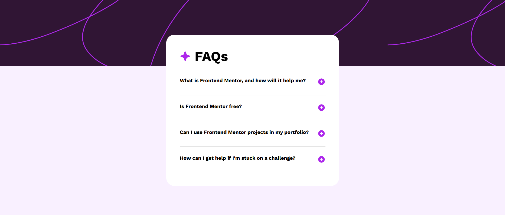

# Frontend Mentor - FAQ accordion solution

This is a solution to the [FAQ accordion challenge on Frontend Mentor](https://www.frontendmentor.io/challenges/faq-accordion-wyfFdeBwBz). Frontend Mentor challenges help you improve your coding skills by building realistic projects. 


## Table of contents

- [Overview](#overview)
  - [The Challenge](#the-challenge)
  - [Screenshot](#screenshot)
  - [Links](#links)
- [My process](#my-process)
  - [Built with](#built-with)
  - [What I learned](#what-i-learned)
- [Author](#author)


## Overview

## Overview

### The challenge

Users should be able to:

- Applying responsive-design
- Using flexbox for layout
- Make it interactive by using JavaScript

### Screenshot



Add a screenshot of your solution. The easiest way to do this is to use Firefox to view your project, right-click the page and select "Take a Screenshot". You can choose either a full-height screenshot or a cropped one based on how long the page is. If it's very long, it might be best to crop it.

Alternatively, you can use a tool like [FireShot](https://getfireshot.com/) to take the screenshot. FireShot has a free option, so you don't need to purchase it. 

Then crop/optimize/edit your image however you like, add it to your project, and update the file path in the image above.

**Note: Delete this note and the paragraphs above when you add your screenshot. If you prefer not to add a screenshot, feel free to remove this entire section.**

### Links

- Solution URL: [GitHub](https://github.com/kelvinjuliusarmandoh/faq-accordion)

## My process

### Built with

- Semantic HTML5 markup
- CSS custom properties
- Flexbox
- Media Queries
- JavaScript

### What I learned

I learn about how to use media queries for responsive design and also flexbox for layouting the page. Then, i learn about JavaScript, how to select element correctly.

To see how you can add code snippets, see below:

```css
body {
  width: 100%;
  height: 100vh;
  display: flex;
  justify-content: center;
  align-items: center;
  flex-direction: column;
  background-color: hsl(275, 100%, 97%);
}

@media (min-width: 375px) and (max-width: 1439px) {
  .top-background {
    background: url(assets/images/background-pattern-mobile.svg);
  }

  .card {
    min-height: 600px;
    max-width: 550px;
    padding-bottom: 25px;
  }
}

h3:hover {
  color: hsl(292, 80%, 53%);
}

```
```js
const imageIcon = button.children[0];
const questionTitle = button.closest(".question-title"); // parent container
const answerText = questionTitle.nextElementSibling; // 
```

## Author

- Github - [Kelvin](https://github.com/kelvinjuliusarmandoh)
- Frontend Mentor - [@kelvinjuliusarmandoh](https://www.frontendmentor.io/profile/kelvinjuliusarmandoh)
